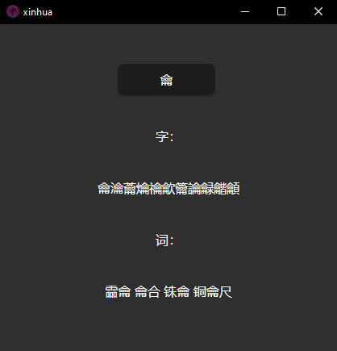

<div align="center">
      
      
</div>
<br/>
<div align="center">

 

</div>

# xinhua-zhaodao

Finds derived Simplified Mandarin characters and words from a given character.

## General info
### Radicals
The given character can be any Unicode character (like ⿕，加 or 丿).  
Thus the input character might not be a Kangxi radical or even a Mandarin character

Note that it will look for the exact character that was passed in - it doesn't recognize alternative forms.  
Therefore derivatives of an alternative form may not be found (水 has 36 results, but 氵 has 765).

### Output
The derivatives are: 
- Derived characters (with graphical composition, not etymological) which exist in the xinhua dictionary. Sorted in ascending order of stroke number.
- Derived words which exist in the xinhua dictionary. Includes proper nouns. Sorted in ascending order of characters number.

### Database
The used database, hanyu.db, is an edited merge of a 新华字典(xinhua zidian) database, a decomposition database and a frequency list. (see  [>Thanks](#thanks))  
Note that some of the DB isn't used yet, but all tables have a purpose for next releases.


## Dev Setup
Using Cargo and Tauri, it should work instantly when cloning: 
```
git clone https://github.com/Coddeus/xinhua-zhaodao.git
cd xinhua-zhaodao
cargo tauri dev

```
Default repo structure : 
```
xinhua-zhaodao
├─ .github
│   └─ workflows
│       ├─ app-check.yml
│       └─ bin-release.yml
├─ .vscode
│   ├─ extensions.json
│   ├─ launch.json
│   └─ settings.json
├─ (dist)
├─ (fonts)
├─ (public)
├─ src
│   ├─ app.rs
│   └─ main.rs
├─ src-tauri
│   ├─ data
│   │   └─ hanyu.db
│   ├─ (icons)
│   ├─ src
│   │   └─ main.rs
│   ├─ build.rs
│   ├─ Cargo.toml
│   └─ tauri.conf.json
├─ (target)
├─ .gitignore
├─ .taurignore
├─ (Cargo.lock)
├─ Cargo.toml
├─ CHANGELOG.md
├─ index.html
├─ README.md
├─ styles.css
└─ Trunk.toml
```


## Uses
This tool may be useful for: 
- Those who want to discover new characters and words (and remember them) through radicals. (original purpose)
- Those who prefer scrolling thousands of Chinese characters (because it's beautiful) instead of social media content.


## Thanks
Data for hanyu.db:
- [Characters decomposition](https://commons.wikimedia.org/wiki/Commons:Chinese_characters_decomposition) on Wikimedia Commons
- [Computerized 新华字典(xinhua zidian) scraper](https://github.com/pwxcoo/chinese-xinhua) on Github
- [Characters frequency](https://lingua.mtsu.edu/chinese-computing/statistics/char/list.php?Which=MO) from Jun Da's website


## License
[CC BY-NC-SA 4.0](https://creativecommons.org/licenses/by-nc-sa/4.0/) 


Coddeus  
2023
